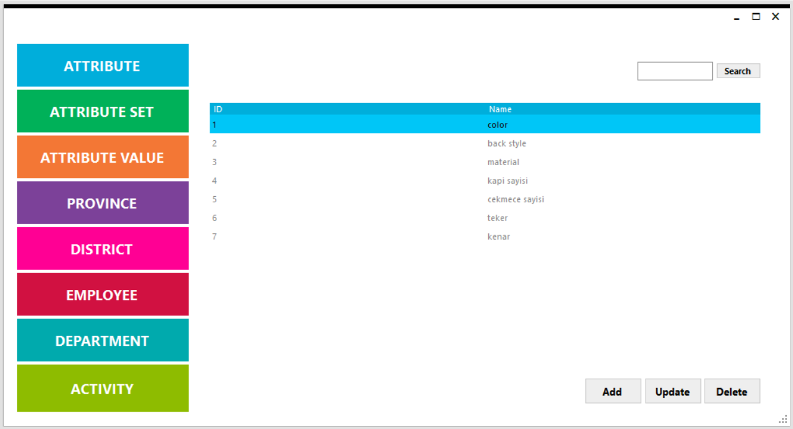
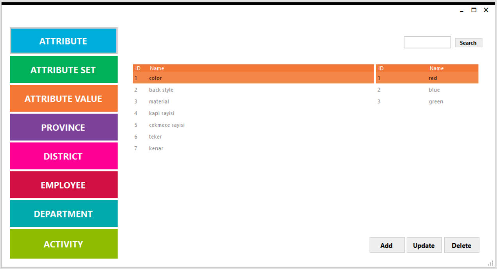
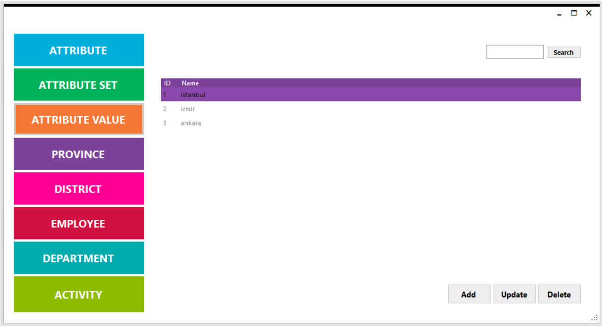
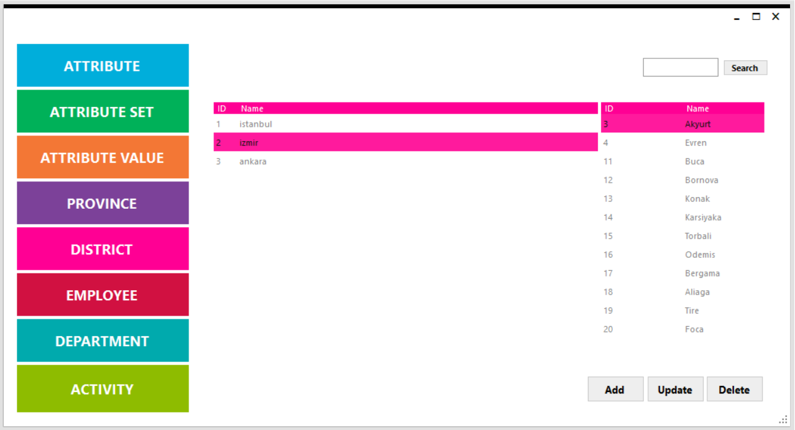
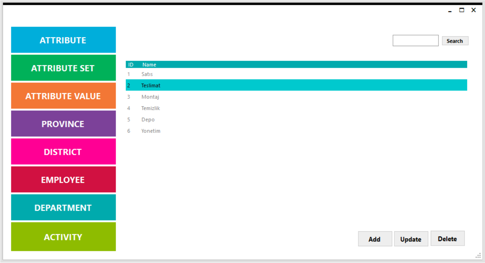
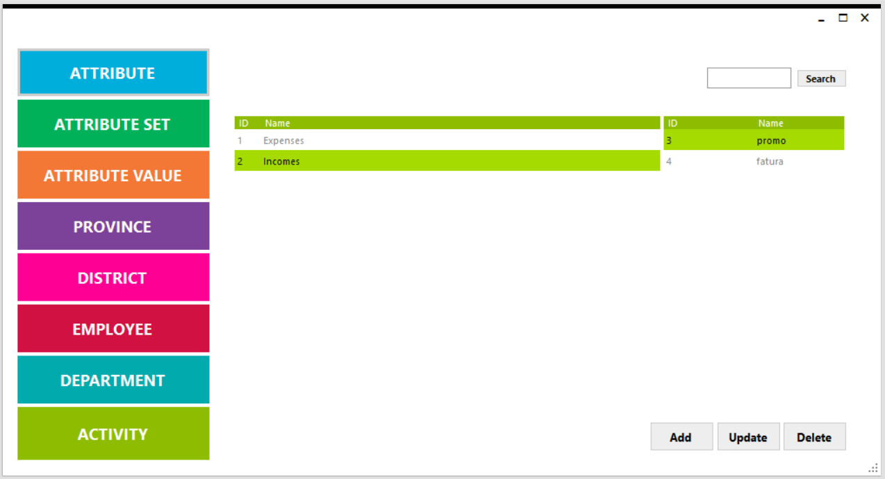

# Admin Panel

## **Attribute**

Ürünlerin alabileceği özellikleri gerekli Sql komutunu kullanarak “attributeGrid” Grid’inde gösterilmektedir.

## **Attribute Set**

Ürünlerin kategorilerini gerekli Sql komutunu kullanarak “activityPanel” Grid’inde gösterilmektedir.

## **Attribute Value**

Ürünlerin özellikleri “activityPanel” Grid’inde, seçilen özelliklerin değerleri de “metroGrid4” Grid’inde gösterilmektedir.

## **Province**

Veri tabanındaki illeri gerekli Sql komutunu kullanarak “provinceGrid” Grid’inde gösterilmektedir.

## **District**

Veri tabanındaki iller gerekli Sql komutunu kullanarak “districtGrid” Grid’inde, seçilen ilin ilçeleri ise “metroGrid6” Grid’inde gösterilmektedir.

## **Employee**

Mağazada çalışan kişilerin verilerini gerekli Sql komutunu kullanarak “employeeGrid” Grid’inde gösterilmektedir.

## **Department**

Mağazada çalışan kişilerin çalıştıkları alanları tutan tabloyu gerekli Sql komutunu kullanarak “departmentGrid” Grid’inde gösterilmektedir.

## **Activity**

Mağazada gerçekleşen gelir gider olaylarını gerekli Sql komutunu kullanarak “departmentGrid” Grid’inde , gelir gider olaylarının içeriklerini de “metroGrid5” Grid’inde gösterilmektedir.

