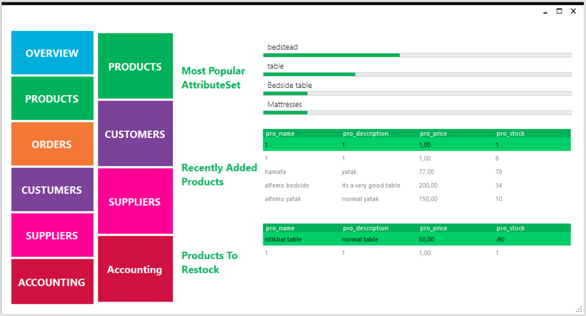
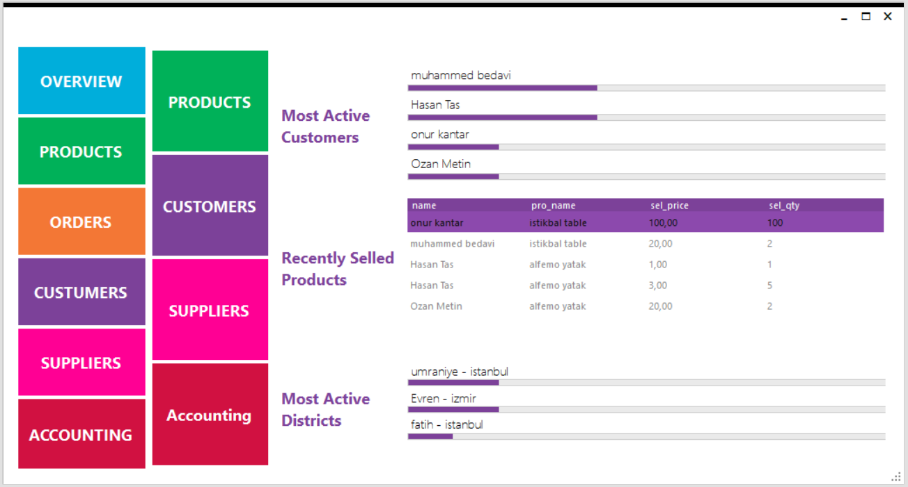
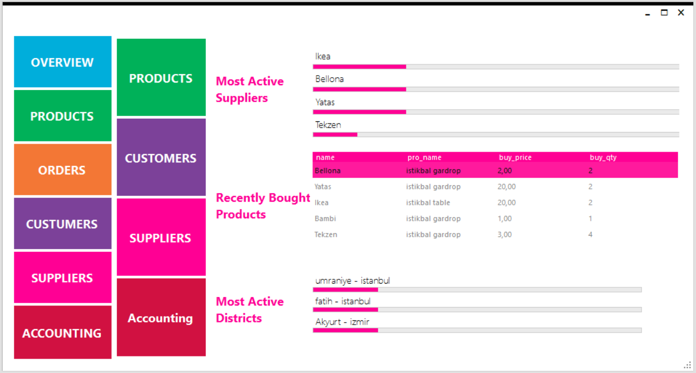
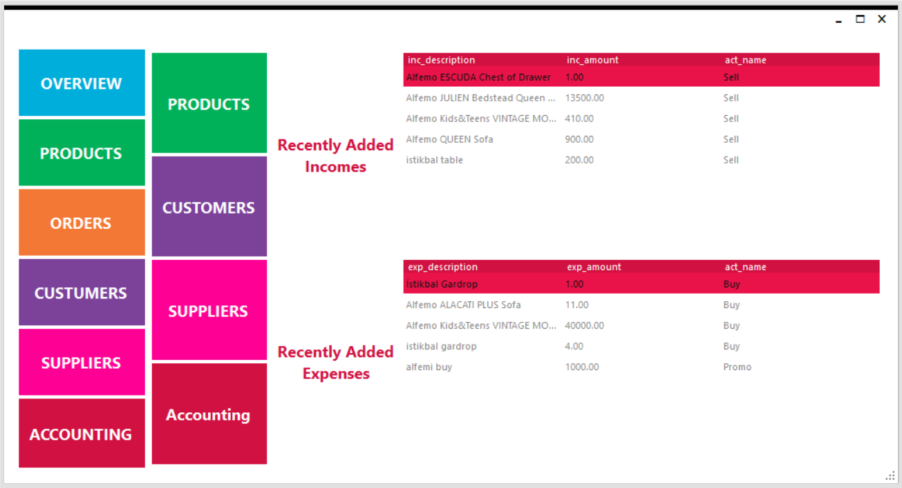
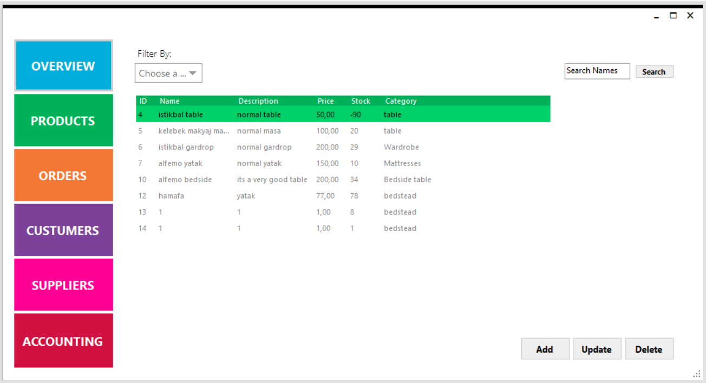
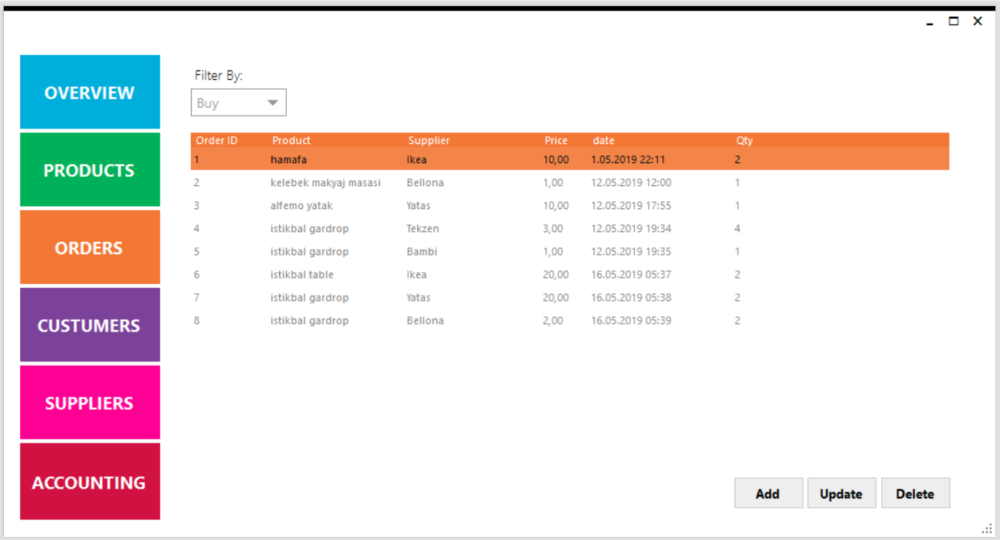
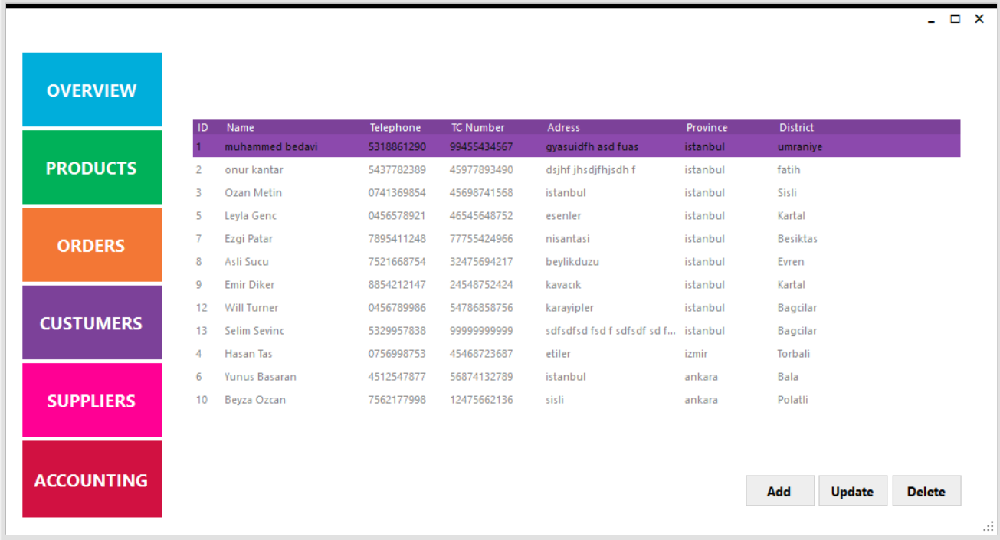
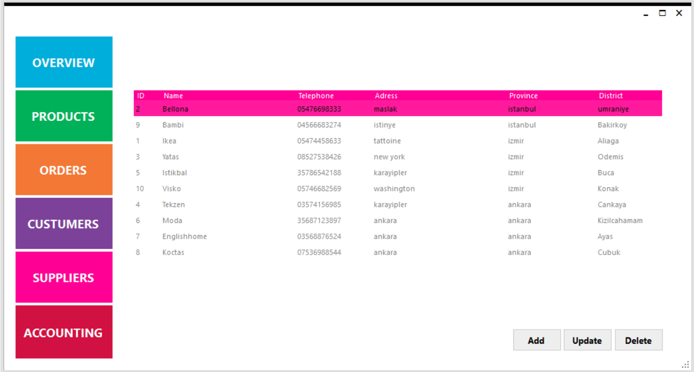
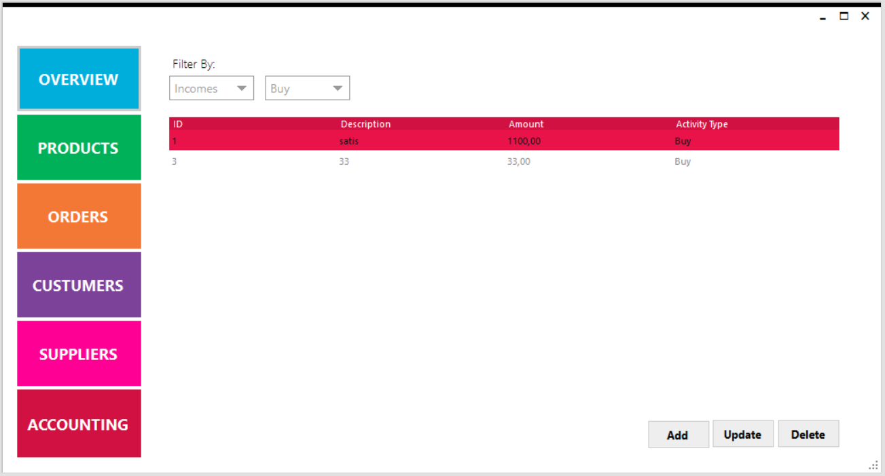

# User Panel

## **Overview**

Veri tabanında son gerçekleşen olaylar, en çok kullanılan kategori grupları, En çok sipariş veren müşterilerin bilgileri gibi olayların gösterildiği bir özet kısmıdır.

### **Products Overview**

Veri tabanındaki en popüler kategori gruplarını, son eklenen ürünleri ve stokta azalan ürünleri gösterildiği kısımdır.

### **Customers Overview**

Veri tabanındaki en çok ürün satılan müşterilerin, son satılan ürünlerin bilgilerinin ve en çok ürün satılan ilçelerin gösterildiği kısımdır.

### **Suppliers Overview**

Veri tabanındaki en çok ürün alınan tedarikçilerin, tedarikçilerden en son alınan ürünlerin bilgilerinin ve en çok ürün tedarik edilen ilçeleri gösteren kısımdır.

### **Accounting Overview**

Şirketin son yapılan gelir ve gider değerlerinin gösterildiği kısımdır.

## **Products**

Veri tabanındaki ürünlerin gelişmiş bir şekilde tutulduğu yerdir. “productsGrid” Grid’inde ürünün temel bilgileri verilirken “metroGrid2” Grid’inde ise seçilen ürünün dış görünüşü hakkında bilgiler gösterilmektedir.

## **Orders**

Mobilya mağazasından alma veya satma olayları hakkında bilgilerin tutulduğu yerdir. İstenilen kategoriyi “Filter” kısmından seçtikten sonra bilgiler “ordersGrid” Grid’inde gösterilmektedir.

## **Costumers**

Müşteri bilgilerinin kapsamlı bir şekilde gösterildiği yerdir. Veriler “customersGrid” Grid’inde gösterilmektedir.

## **Suppliers**

Tedarikçi bilgilerinin kapsamlı bir şekilde gösterildiği yerdir. Veriler “suppliersGrid” Grid’inde gösterilmektedir.

## **Accounting**

Muhasebe ile alakalı bilgilerin gösterildiği kısımdır. Verilerin gösterilmesi için öncelikle “Filter” kısmından istenilen kategoriler seçilmelidir. Ardından veriler “accountingGrid” Grid’inde gösterilmektedir.

